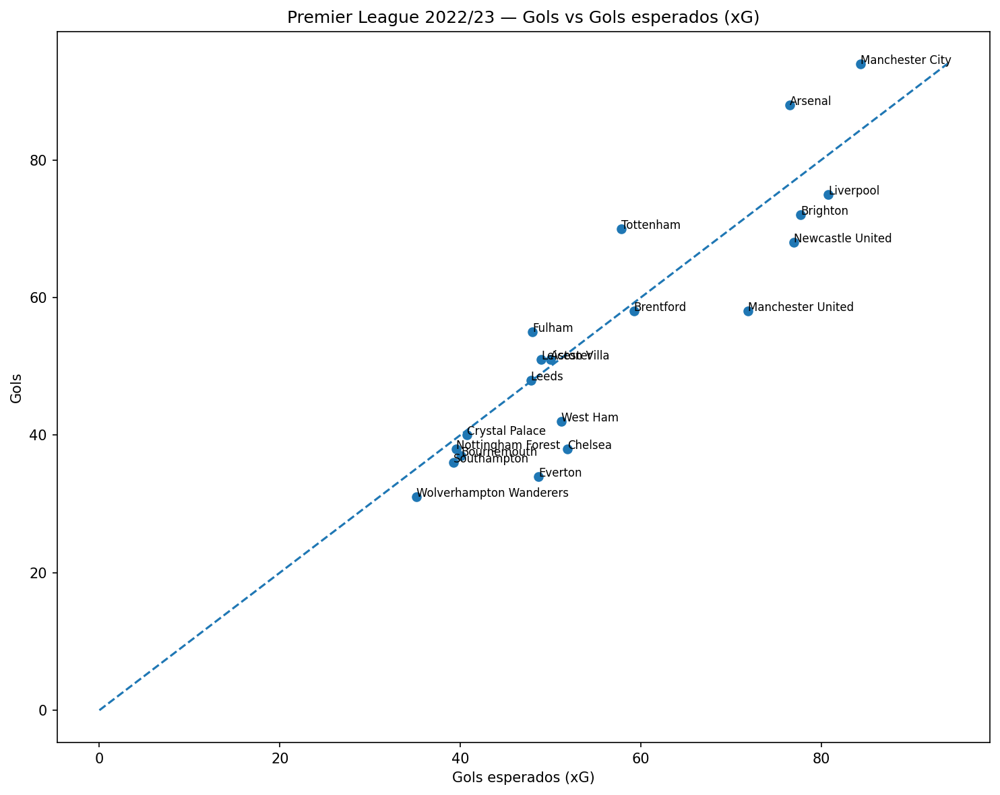
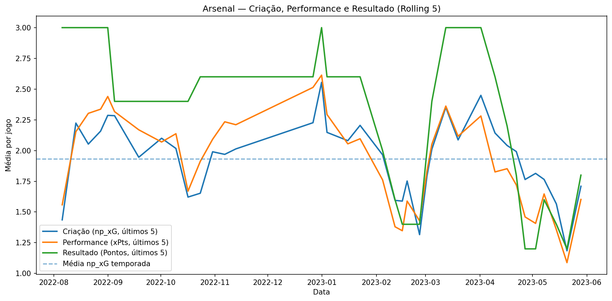
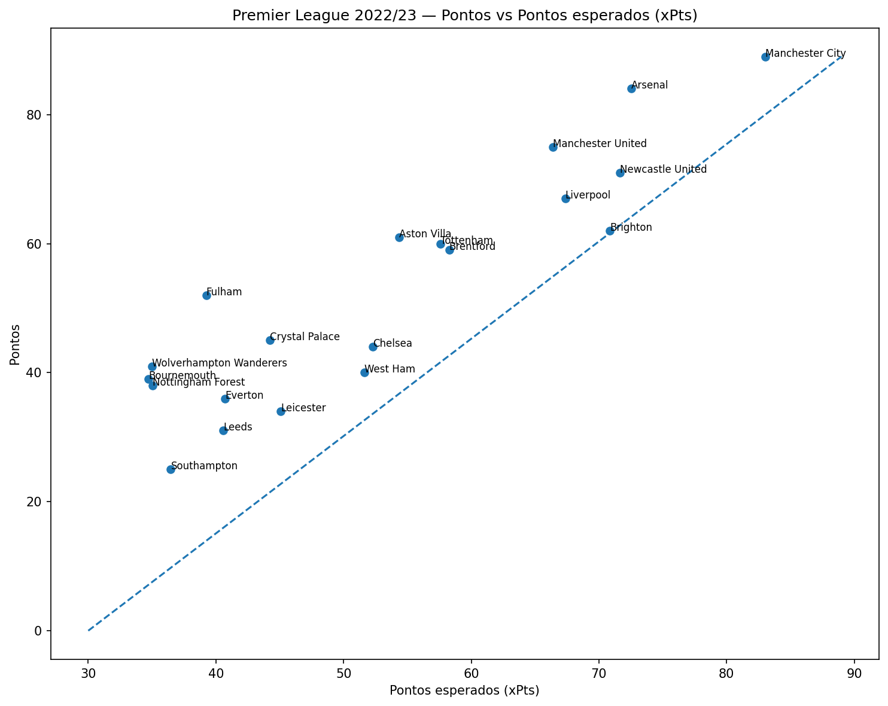
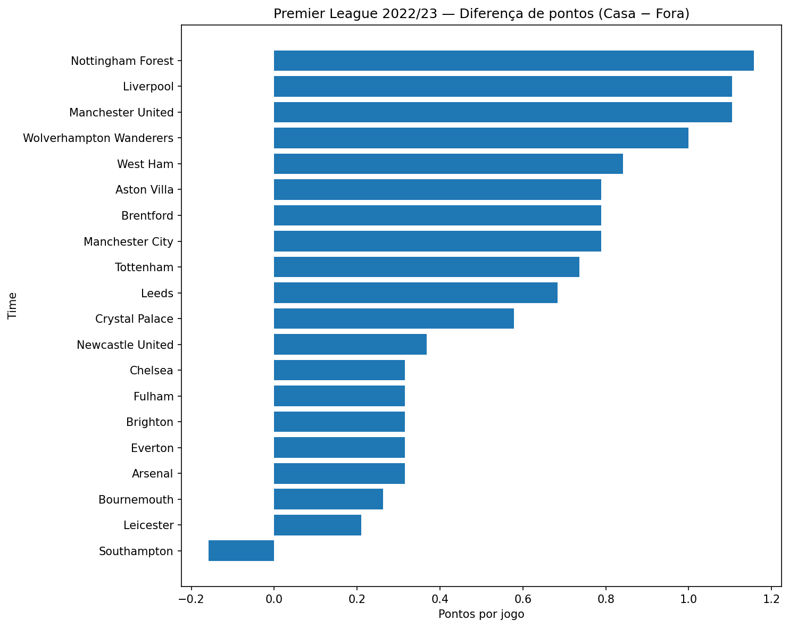

# Premier League Analytics — xG, xPts e Forma de Jogo
 
## Visão geral

Este projeto tem como objetivo explorar dados avançados de futebol da Premier League na temporada de 2022/23, utilizando métricas como Gols esperados (xG), non-penalty xG (np_xG) e Pontos esperados (xPts) para analisar desempenho, eficiência e forma dos times ao longo da temporada.

A ideia central é ir além do placar final e responder perguntas como:

- Quais times criaram mais chances de gol?

- Quem converteu acima ou abaixo do esperado?

- Os resultados refletem a performance em campo?

- Como o desempenho muda ao longo do tempo e entre casa e fora?

---

# Fonte dos dados

- Biblioteca Python: soccerdata

- Fonte original: Understat

- Competição: Premier League

- Temporada: 2022/23

---

# Conceitos utilizados

## xG (Expected Goals)

xG estima a probabilidade de uma finalização virar gol com base em características do chute, os modelos de xG são treinado utilizando registros e dados de milhares de finalizações.

Cada chute vira um registro com variáveis como:

- distância até o gol

- ângulo do chute

- parte do corpo (pé, cabeça)

- tipo de assistência (cruzamento, passe em profundidade, rebote)

- situação do jogo (bola parada, jogo corrido)

- posição do goleiro (em modelos mais avançados)

### Como o xG é usado na análise

Soma de xG em um jogo = qualidade total das chances criadas

Exemplo prático:

Um time marcou 1 gol, mas teve xG de 2.4.

Isso sugere que ele criou chances suficientes para marcar mais, mas converteu mal.

## np_xG (non-penalty Expected Goals)

np_xG é o xG sem considerar pênaltis.

### Por que remover pênaltis?

- Pênaltis têm xG alto e quase fixo (~0,76)

- Dependem mais de decisões de arbitragem do que de criação ofensiva

- Podem inflar artificialmente o xG de um time

### Como o np_xG é usado

- Medir criação ofensiva sustentável

- Comparar estilos de jogo

- Análises de forma (rolling)

## xPts (Expected Points)

xPts estima quantos pontos um time deveria ter conquistado com base no desempenho do jogo.

### Como o xPts é calculado

O modelo estima:

- probabilidade de vitória

- probabilidade de empate

- probabilidade de derrota

A partir disso, é usada a fórmula:

xPts = (3 × P(vitória)) + (1 × P(empate))

### Como o xPts é usado

- Comparar desempenho vs resultado

- Identificar times “sortudos” (overperforming) ou “azarados” (underperforming)

- Avaliar consistência ao longo da temporada

## Rolling metrics (médias móveis)

Rolling metrics são médias calculadas em janelas móveis, como os últimos 5 ou 10 jogos.

### Como funciona

Em vez de usar a média da temporada inteira, o rolling foca no desempenho recente.

Exemplo:

- xG dos últimos 5 jogos: `[1.8, 2.1, 1.4, 2.5, 1.9]`

- rolling xG (5) = 1.94

### Por que usar rolling?

- Captura “fase” do time

- Identifica tendências

- Reduz impacto de jogos muito antigos

### Como foi usado no projeto

- rolling np_xG = forma ofensiva recente

- rolling xPts = performance recente

- rolling pontos = resultado recente

Comparando os três, é possível separar:

- desempenho real

- eficiência

- variância

---

# Metodologia

Os dados foram normalizados para o formato “long”, onde cada linha representa um time em uma partida.

Métricas foram agregadas por temporada e analisadas em janelas móveis.

Foram comparados:

- gols reais vs gols esperados xG

- pontos reais vs pontos esperados

- desempenho recente vs média da temporada

- desempenho como mandante vs visitante

---

# Principais análises e insights

## 1. Eficiência ofensiva (Gols vs xG)

- Times podem marcar mais ou menos gols do que o esperado com base na qualidade das chances criadas, indicando eficiência, fase ou variância.

  

## 2. Forma ofensiva ao longo da temporada (Rolling 5)

- Ao observar o np_xG em janelas móveis, é possível identificar períodos de melhora ou queda na criação ofensiva, independentemente do resultado final.

  

## 3. Resultado vs performance (Pontos vs xPts)

- Comparar pontos reais com pontos esperados ajuda a separar desempenho em campo de eficiência nos resultados.

  

## 4. Impacto do mando de campo (Casa vs Fora)

- A análise casa vs fora mostra como o desempenho médio muda de acordo com o local da partida, evidenciando dependência ou consistência dos times.

  

--- 

# Limitações

- O xG é um modelo estatístico e não captura todos os aspectos do jogo.

- Não foram considerados fatores como lesões, contexto tático detalhado ou decisões de arbitragem.

- A análise é descritiva, não preditiva.

--- 

# Como rodar o notebook

`pip install -r requirements.txt`

Abra o notebook em `notebooks/understat_analysis.ipynb.`